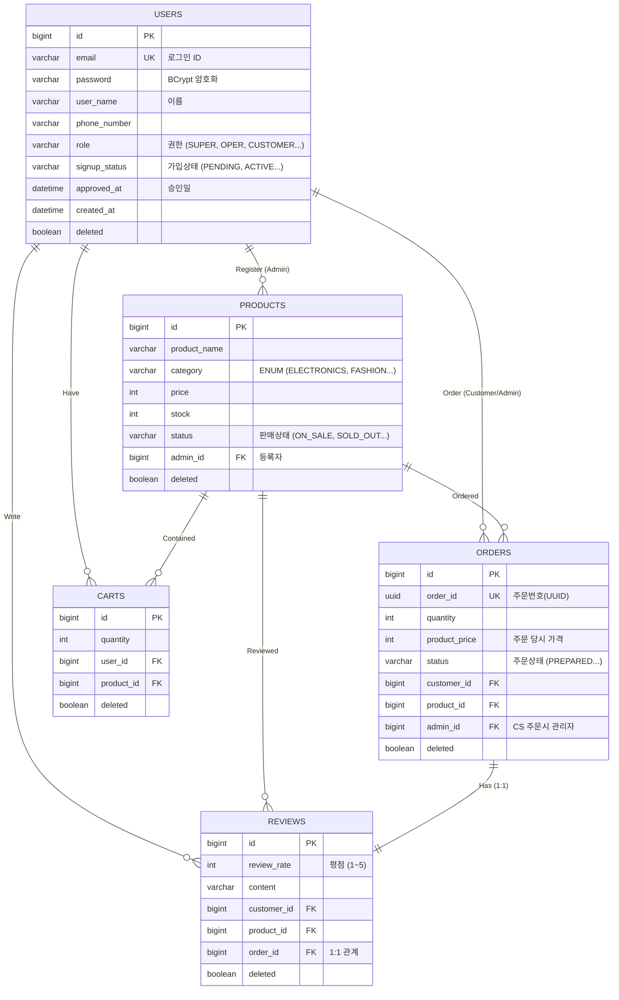

# 🏢 M6nyToOne Project (이커머스 백오피스 & 서비스)

이 프로젝트는 **Spring Boot 기반의 이커머스 백오피스 및 고객 서비스 API 서버**입니다.  
관리자(Admin)의 가입 승인 시스템부터 상품, 주문, 고객 관리 기능을 제공하며, **JWT 기반의 인증/인가**와 **RBAC(Role-Based Access Control)**를 통해 안전하고 체계적인 접근 제어를 구현했습니다.

---

## 🧱 기술 스택 (Tech Stack)

- **Framework**: Spring Boot 3.x
- **Language**: Java 17
- **Database**: MySQL
- **ORM**: Spring Data JPA (Hibernate)
- **Security**: Spring Security, JWT (Json Web Token)
- **Documentation**: Swagger (SpringDoc)
- **Tool**: Gradle, IntelliJ IDEA

---

## 👨‍👩‍👧‍👦 팀원 역할 분담 (Team Roles)

### 👥 팀원 구성 및 담당 업무

| 역할 (Role) | 이름 (Name) | 담당 업무 (Main Tasks) |
| :---: | :---: | :--- |
| **Leader** | **이석형** | • 일정 지연 리스크 관리 및 의사 결정 주도 • 글로벌 서비스 아키텍처 설계 및 구현 |
| **Presentation** | **선경안** | • 발표 자료(PPT) 기획 및 제작 |
| **Documentation** | **팀장 주도** | • 회의록 정리 및 문서화 • README 수합 및 관리 (작성은 팀원 전체 참여) |
| **User Domain** | **이승현** | • 유저(User) 도메인 API 및 비즈니스 로직 구현 |
| **Product Domain** | **양예나** | • 상품(Product) 도메인 API 및 비즈니스 로직 구현 |
| **Cart Domain** | **선경안** | • 장바구니(Cart) 도메인 API 및 비즈니스 로직 구현 |
| **Order Domain** | **최재민** | • 주문(Order) 도메인 API 및 비즈니스 로직 구현 |
| **QA / Test** | **양예나** | • Postman을 활용한 API 별 테스트 시나리오 구현 및 검증 |
| **Security** | **이석형, 최재민** | • **JWT** 기반 인증 시스템 및 **RBAC**(역할 기반 접근 제어) 구현 |

---

## 📋 API 명세서 (API Specification)

**Common Info**
- **Authentication**: 모든 API 요청(로그인/가입 제외)은 `Authorization` 헤더에 **Bearer Token**이 필요합니다.
- **Response**: 모든 응답은 `ApiResponseDto` 표준 규격을 따릅니다.

### 1. 유저 (User & Admin) API
*(Base URL: `/users`)*

| 기능 | Method | URL | 권한 | 비고 |
| :--- | :---: | :--- | :--- | :--- |
| **관리자 회원가입** | `POST` | `/signup` | `ALL` | 승인 대기 상태(`PENDING`)로 생성 |
| **로그인** | `POST` | `/login` | `ALL` | **JWT Access Token 발급** |
| **로그아웃** | `POST` | `/logout` | `AUTH` | 클라이언트 토큰 폐기 필요 |
| **승인 대기 관리자 조회** | `GET` | `/pendings` | `SUPER` | 가입 승인 대기중인 관리자 목록 |
| **관리자 가입 승인/거부** | `PATCH` | `/pendings/{userId}` | `SUPER` | 상태 변경 (`ACTIVE`/`REJECTED`) |
| **등록된 관리자 조회** | `GET` | `/registered` | `SUPER` | 정식 등록된 관리자 목록 |
| **관리자 정보 수정** | `PATCH` | `/registered/{userId}/info` | `SUPER` | 타 관리자 정보 수정 |
| **관리자 역할 변경** | `PATCH` | `/registered/{userId}/status` | `SUPER` | Role 변경 (`OPER`, `CS` 등) |
| **내 정보 조회** | `GET` | `/me` | `AUTH` | 본인 프로필 조회 |
| **내 정보 수정** | `PATCH` | `/me/update` | `AUTH` | 본인 정보 수정 |
| **내 비밀번호 변경** | `PATCH` | `/me/password` | `AUTH` | 본인 비밀번호 변경 |
| **고객 목록 조회** | `GET` | `/customers` | `SUPER` | 전체 고객 조회 (통계 포함) |
| **고객 상세 조회** | `GET` | `/customers/{userId}` | `SUPER` | 특정 고객 상세 조회 |
| **고객 상태 변경** | `PATCH` | `/customers/{userId}/status` | `SUPER` | 고객 활성/정지 상태 변경 |

### 2. 상품 (Product) API
*(Base URL: `/products`)*

| 기능 | Method | URL | 권한 | 비고 |
| :--- | :---: | :--- | :--- | :--- |
| **상품 등록** | `POST` | `/` | `SUPER`, `OPER` | 관리자만 등록 가능 |
| **상품 전체 조회** | `GET` | `/` | `ALL` | 검색, 카테고리, 상태 필터링 지원 |
| **상품 단건 조회** | `GET` | `/{productId}` | `ALL` | **리뷰 통계 및 최신 리뷰 포함** |
| **상품 정보 수정** | `PATCH` | `/{productId}` | `SUPER`, `OPER` | 이름, 가격, 카테고리 수정 |
| **상품 재고 수정** | `PATCH` | `/{productId}/stocks` | `SUPER`, `OPER` | 재고 변경 시 상태 자동 동기화 |
| **상품 상태 수정** | `PATCH` | `/{productId}/status` | `SUPER`, `OPER` | 판매중/품절/단종 상태 변경 |
| **상품 삭제** | `DELETE` | `/{productId}` | `SUPER`, `OPER` | **Soft Delete** (단종 처리) |

### 3. 주문 (Order) API
*(Base URL: `/orders`)*

| 기능 | Method | URL | 권한 | 비고 |
| :--- | :---: | :--- | :--- | :--- |
| **고객 주문 생성** | `POST` | `/{cartId}/customers` | `CUSTOMER` | 장바구니 상품 주문 |
| **CS 대리 주문** | `POST` | `/{customerId}/cs` | `ADMIN` | 관리자가 고객 대신 주문 생성 |
| **주문 목록 조회** | `GET` | `/lists` | `ADMIN` | 전체 주문 관리 (검색/필터) |
| **내 주문 조회** | `GET` | `/list/customers` | `CUSTOMER` | 본인 주문 내역 조회 |
| **주문 상세 조회** | `GET` | `/{orderId}` | `AUTH` | 주문 상세 정보 (UUID 사용) |
| **주문 상태 변경** | `PATCH` | `/{orderId}/status` | `ADMIN` | 준비중 -> 배송중 -> 완료 |
| **주문 취소** | `DELETE` | `/{orderId}/cancel` | `AUTH` | 준비중 상태에서만 가능 |

### 4. 리뷰 (Review) API
*(Base URL: `/reviews`, `/orders`)*

| 기능 | Method | URL | 권한 | 비고 |
| :--- | :---: | :--- | :--- | :--- |
| **리뷰 등록** | `POST` | `/orders/{orderId}/reviews` | `CUSTOMER` | 배송 완료된 주문만 작성 가능 |
| **리뷰 목록 조회** | `GET` | `/reviews` | `ALL` | 상품별/평점별 필터링 |
| **리뷰 상세 조회** | `GET` | `/reviews/{reviewId}` | `ALL` | - |
| **리뷰 삭제** | `DELETE` | `/reviews/{reviewId}` | `ADMIN` | 부적절한 리뷰 관리자 삭제 |

### 5. 대시보드 (Dashboard) API
*(Base URL: `/boards`)*

| 기능 | Method | URL | 권한 | 비고 |
| :--- | :---: | :--- | :--- | :--- |
| **요약 통계** | `GET` | `/summary` | `ADMIN` | 회원/상품/주문 전체 현황 |
| **위젯 데이터** | `GET` | `/widgets` | `ADMIN` | 일일 매출, 배송 현황 등 |
| **차트 데이터** | `GET` | `/charts` | `ADMIN` | 평점 분포, 카테고리 분포 등 |
| **최근 주문** | `GET` | `/recentOrders` | `ADMIN` | 최신 10건 주문 목록 |

---

## 🛠️ ERD (Entity Relationship Diagram)

---

## 💡 주요 기능 및 로직 설명 (Feature & Logic)

### 1. 3-Layer Architecture & Entity 설계
- **계층 분리:** `Controller`, `Service`, `Repository`로 역할을 명확히 분리하여 유지보수성을 높였습니다.
- **DTO 사용:** Entity를 직접 노출하지 않고 `RequestDto`, `ResponseDto`를 통해 데이터를 주고받아 보안과 유연성을 확보했습니다.
- **BaseEntity:** 모든 엔티티는 `BaseEntity`를 상속받아 `createdAt`, `modifiedAt`을 자동으로 관리(JPA Auditing)합니다.
- **Soft Delete:** `@SoftDelete(columnName = "deleted")` 어노테이션을 활용하여 데이터를 물리적으로 삭제하지 않고 보존합니다.

### 2. JWT 인증 및 Spring Security (RBAC)
- **JWT (JSON Web Token):** Stateless한 인증을 위해 세션 대신 JWT를 도입했습니다.
    - 로그인 성공 시 `Authorization: Bearer {token}` 헤더를 발급합니다.
    - `JwtFilter`를 통해 모든 요청의 토큰 유효성을 검증합니다.
- **Spring Security:**
    - `SecurityConfig`에서 URL 별 접근 권한을 설정했습니다.
    - **RBAC (Role-Based Access Control):** `@PreAuthorize("hasRole('SUPER')")` 등을 사용하여 메서드 단위로 정교한 권한 제어를 구현했습니다.
    - **CustomUserDetails:** DB의 `User` 정보를 시큐리티 컨텍스트에 매핑하여 인증 객체로 활용합니다.

### 3. 백오피스 관리자 시스템 (Admin System)
- **가입 승인 프로세스:**
    - 관리자는 회원가입 시 `PENDING`(승인 대기) 상태로 생성됩니다.
    - `SUPER_ADMIN`만이 대기 중인 관리자를 `ACTIVE`(승인) 또는 `REJECTED`(거부) 처리할 수 있습니다.
- **권한 계층:**
    - `SUPER`: 최고 관리자 (관리자 승인, 역할 변경, 전체 조회 등)
    - `OPER`: 운영 관리자 (상품, 주문 관리)
    - `CS`: 고객 지원 관리자 (주문 취소, 배송 관리)
    - `MARKET`: 마케팅 관리자

### 4. 상품 및 재고 관리 (Inventory Management)
- **재고 동기화:** 상품 주문 및 취소 시 재고(`stock`)가 실시간으로 차감되거나 복구됩니다.
- **상태 자동 변경:**
    - 재고가 0이 되면 자동으로 `SOLD_OUT`(품절) 상태로 변경됩니다.
    - 재고가 채워지면 `ON_SALE`(판매중) 상태로 복구됩니다.
- **비관적 락 (Pessimistic Lock):** `findByIdWithPessimisticLock`을 통해 동시 주문 발생 시 재고 정합성을 보장합니다.

### 5. 예외 처리 및 응답 통일 (Global Exception Handling)
- **GlobalExceptionHandler:** 발생하는 모든 예외(Custom Exception, Validation Error 등)를 중앙에서 잡아 처리합니다.
- **ApiResponseDto:** 성공(`success`), 페이징(`pagination`), 에러(`error`) 응답을 통일된 JSON 구조로 반환하여 클라이언트와의 통신 규격을 맞췄습니다.

### 6. 대시보드 및 통계 (Dashboard & Statistics)
- **통계 쿼리 최적화:** `countBy`, `groupBy` 등 JPA 및 JPQL을 활용하여 실시간 통계 데이터를 효율적으로 조회합니다.
- **데이터 시각화 지원:** 위젯, 차트용 데이터를 API로 제공하여 프론트엔드에서 대시보드를 구성할 수 있도록 지원합니다.